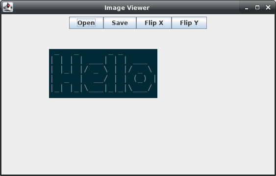
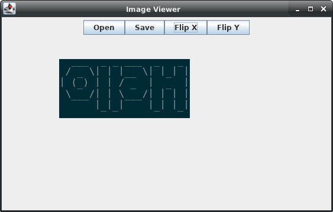

# About:
J-image-viewer is written in Java using Swing and AWT. The supported image file formats are jpg, png, bmp, wbmp, and gif. Basic image editing is availible using the rotate or mirror functions.

# How to use:
In this git repository, run these commands:
```
$ ./make_jar.sh #makes a single jar file

$ java -jar j_image_viewer.jar #runs the program

$ ./make_clean.sh #cleans out the jar and class files
```




